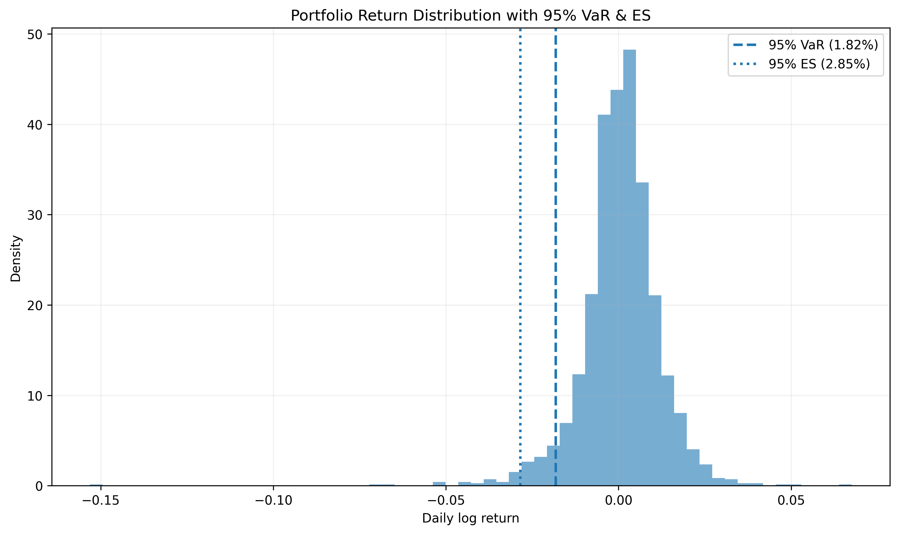
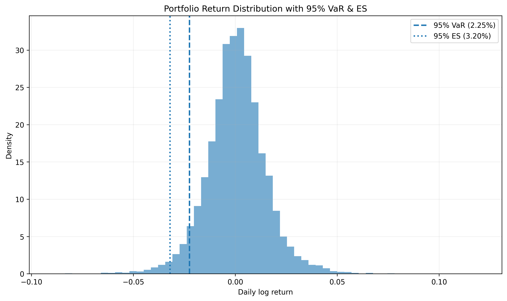
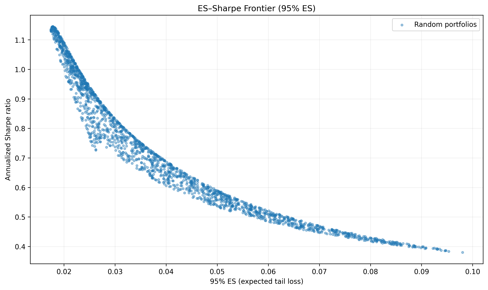
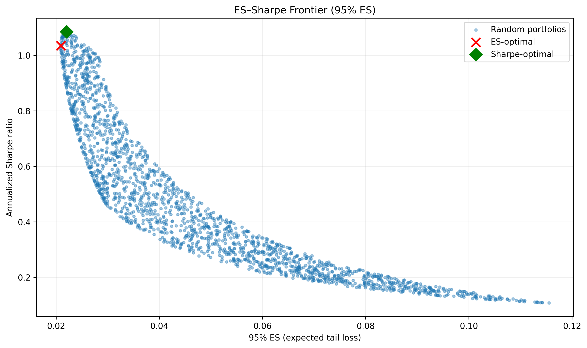

# 📊 VaR & Expected Shortfall Portfolio Lab
*A quantitative risk-modelling project comparing historical vs heavy-tailed Monte Carlo tail risk.*

<p align="center">
  
</p>

---

## 🎯 Overview

This project demonstrates practical **market risk modelling** using a 3-asset portfolio:

- **Bitcoin (BTC/EUR)**
- **Gold (EUR)**
- **IWDA – MSCI World ETF (EUR)**  

It computes and visualizes:

- **Historical VaR & Expected Shortfall (ES)**
- **Monte Carlo (Student-t) VaR & ES**
- **ES–Sharpe efficient frontiers**
- **Optimal portfolios**:
  - Minimum-ES (tail-risk minimization)  
  - Maximum-Sharpe (risk-adjusted return)

It also compares **historical** vs **heavy-tailed simulated** markets — showing how risk explodes when returns are not Gaussian.

---

## 📌 Why This Project Matters

Modern risk management (Basel III/IV) requires banks to measure market risk using **Expected Shortfall**, not VaR.

This project shows:

- Why ES is a superior tail-risk measure  
- How optimal portfolios shift under heavy tails  
- Why crypto disappears in ES-minimizing portfolios  
- How Sharpe optimality vs ES optimality differ  
- How Student-t simulation dramatically inflates 99%+ ES  
- How efficient frontiers deform with fat tails  

This is the type of hands-on quantitative work recruiters love to see.

---

# 🧩 Features

## **1. Data Loader (`data_loader.py`)**

- Downloads daily prices from Yahoo Finance:
  - `BTC-EUR` — Bitcoin  
  - `GC=F` — Gold futures (USD)  
  - `EURUSD=X` — FX rate for conversion  
  - `IWDA.AS` — iShares MSCI World ETF  
- Converts Gold from USD → EUR  
- Computes **daily log returns**  

---

## **2. Risk Engine (`var_es.py`)**

Computes **historical VaR & ES** using empirical returns.

Supports:

- ✓ Any confidence levels (95%, 99%, 99.5%, …)  
- ✓ Any horizon via √time scaling  
- ✓ Portfolio-level VaR & ES from raw returns  

---

## **3. Optimizers (`optimizer.py`)**

### ✔ Minimum ES Portfolio (95% ES)
- Finds long-only weights minimizing tail risk  
- Uses SLSQP with:
  - weights ≥ 0  
  - sum(weights) = 1  

### ✔ Maximum Sharpe Portfolio
- Annualized Sharpe (252-day convention)  
- Same constraints as above  

---

## **4. Monte Carlo Simulation (`mc_sim.py`)**

Simulates **multivariate Student-t** returns:

- Calibrated to historical mean & covariance  
- Default **df = 5** (heavy tails)  
- Produces multiple new years of synthetic data  
- Used to compare risk under fat-tailed markets  

---

## **5. Plotting (`plotting.py`)**

### Histogram — VaR & ES Cutoffs
<p align="center">
  
</p>

### Monte Carlo VS Distribution
<p align="center">
  
</p>

### Historical ES–Sharpe Frontier
<p align="center">
  
</p>

### Simulated ES–Sharpe Frontier
<p align="center">
  
</p>

### Combined Frontier Comparison
<p align="center">
  
</p>

---

## **6. Orchestration Pipeline (`main.py`)**

`main.py` ties the entire project together:

1. Load historical data  
2. Plot historical VaR/ES distribution  
3. Simulate Student-t returns  
4. Plot simulated VaR/ES distribution  
5. Compute & print:
   - Current-weight VaR/ES  
   - ES-optimal portfolio  
   - Sharpe-optimal portfolio  
6. Compare tail metrics:
   - 95% / 99% / 99.5% VaR & ES  
   - Historical vs simulated  
7. Plot:
   - Historical frontier  
   - Simulated frontier  
   - Combined comparison frontier  

Running:

```bash
python main.py
```
## Project Structure
```
var_es_project/
├── data_loader.py       # Price download, FX conversion, log returns
├── var_es.py            # Historical VaR/ES computation
├── optimizer.py         # ES-min & Sharpe-max optimizers
├── mc_sim.py            # Student-t Monte Carlo simulation
├── plotting.py          # Histograms, frontiers, comparison plots
├── config.py            # Parameters (weights, CLs, horizon, date range)
├── main.py              # Full pipeline
├── figures/             # Auto-generated plots for the README
└── README.md            # This file
```